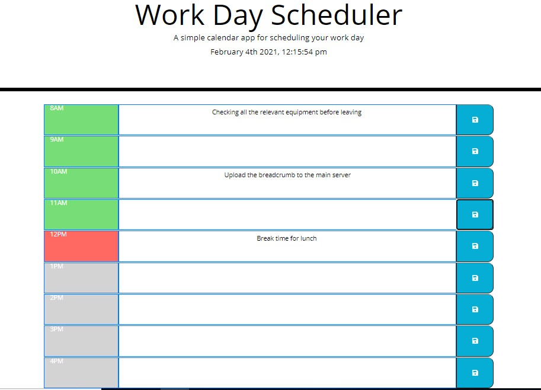
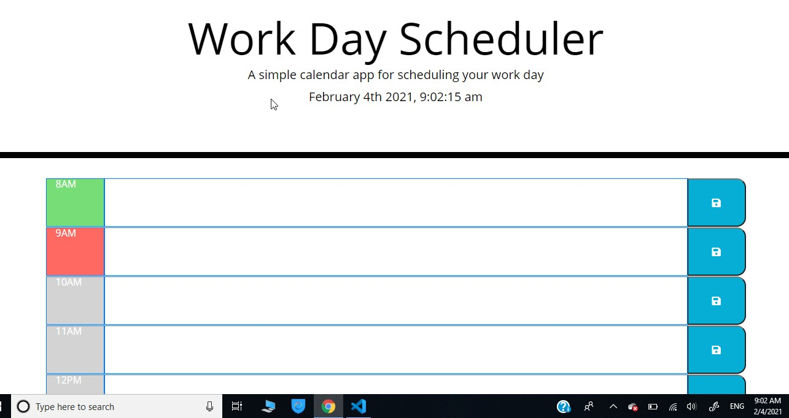

# Event-Scheduler-
## Motivation
Most of event scheduler calanders are designed for 24 hours, this one is crafted only for "work hours" from 8 AM to 4 PM.

 

## lesson learned 
writting formating and manupulating a code for the event scheduelr lets me to reach a lot of subject areas. 

 

## resoureces
#### Moment js
#### W3school
#### MDN Web Docs
#### stackoverflow
#### my toutor
#### learning assistant 
## links 
#### https://bayleyegn100.github.io/Event-Scheduler-/
#### https://github.com/bayleyegn100/Event-Scheduler-/tree/master

 

 ## End
